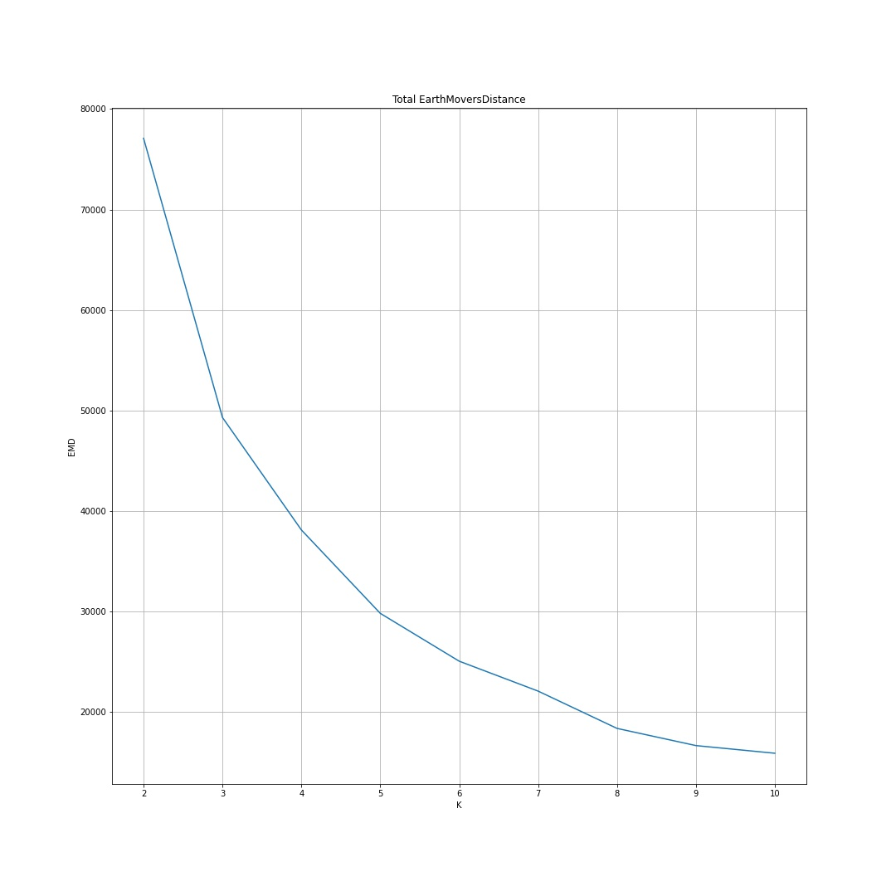

# 10 Questions

## Flight Data Clustering Using EP-Means

Brandon Sams

05Mar2021

1. How did you come across this technique?

    At my day job, I came across a situation where I needed to cluster distributions of data. I work in Traffic Engineering, and wanted to cluster different periods of a day, based on the traffic that occured, regardless of total volume.

2. How did you choose initial cluster centers?

    While it is perfectly fine to choose centers randomly, and with enough repeated trials, the correct clusters will appear, that is not the only way to achieve this. I built an implementation of kmeans++, which tends to require fewer iterations. This involves computing an average value, and then using a weighted random choice based on the minimum distance from any cluster center. Repeat until enough centers are defined to start.

3. What challenges did you encounter with this project?

    The original paper that detailed how to implement this method was a little sparse on a few details, such as how exactly to calculate the Earth Mover's Distance. The original implementation actually calcuated it based off the inverse CDFs, rather than CDFs. I think this was done for performance reasons? But area is area, regardless of which way the axes are flipped, so I ended up just using the CDFs.

4. Is there any purpose, that you are aware of, for clustering flight routes based on flight duration?

    Honestly, I don't think that there is much practical application, but it is the generalized method that deserved to be the star of this analysis. Flight data is plentiful, and is fairly straightforward to make into distributions.

5. Was there any part of the EP-Means method that you didn't fully understand, but implemented anyways?

    Yes, definitely. When computing the distance between a given distribution and the cluster centers, the Earth Mover's Distance is actually squared before finding which cluster center is the "closest". I dont fully understand why this is necessary, since EMD is a positive value already. But, the establised method called for it, so I implemented it as given.

6. What are your thoughts on the Earth Mover's Distance? Is it a reliable metric for distance?

    I am fascinated with this distance metric. I rememeber reading about Manhattan Distance and Haversine Distance in books, but I hadn't ever seen this metric discussed. It it fairly intuitive, and very fast to compute. It's amazing, and I wish I had found out about it sooner.

7. Is there any advantage to using EP means, as opposed to any other distribution clustering algorithm? (I'm assuming those exist)

    The biggest advantage that this technique has is that it makes no assumptions about the shape of the distribution. Distributions can be normal, bimodal, uniform, etc. 

8. Are there other possible uses for clustering distributions that you could find?

    I did come across one instance where network traffic was clustered. I think that was a fascinating example, because network traffic is notoriously messy and complicated. This turned out to be a great tool for that, since no assumptions about distribution shape need to be made.

9. So what ended up being the best value for k, and how did you find it?

    I ran the process for several values of K, and each time, measured the total EMD between each distribution and its corresponding cluster center. As K increases, this total error will decrease, but at k=5 was the "elbow point" in the plot.

10. Is there something that you wanted to analyze about this dataset that you didn't quite get to do?

    Yes, I wanted to try and find a way to see how the clusters change over time, if at all. I ended up abandoning this idea, becuase I think it is unlikely that there would be a significantly different collection of distributions from 2009-2018.